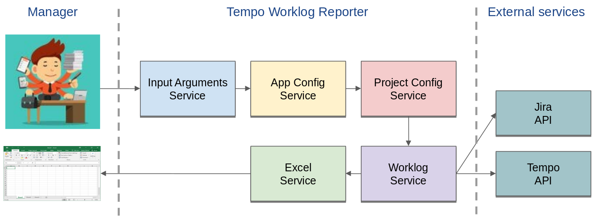
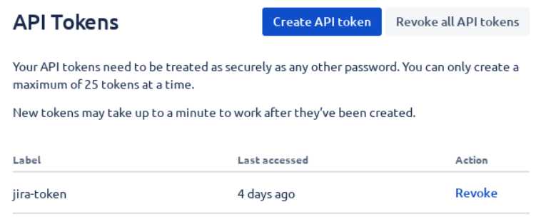
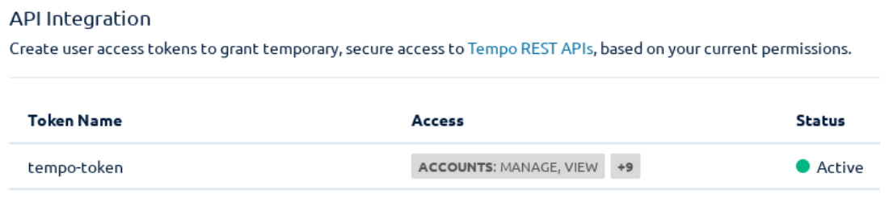
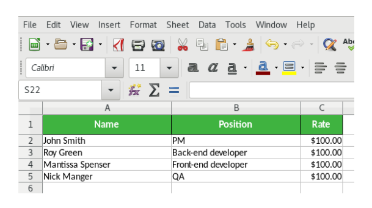
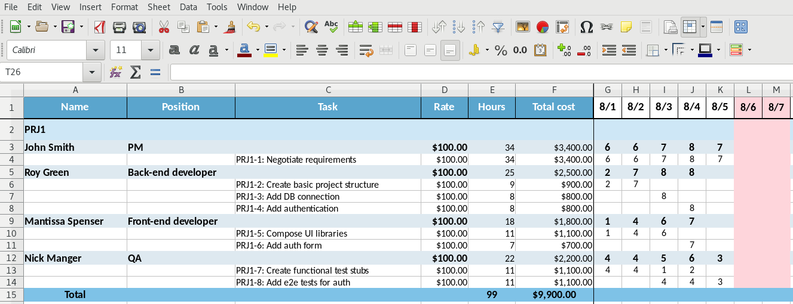

# Tempo Worklog
Automates the creation of reports for managers using Atlassian Jira and Tempo plugin with export to Excel table.

## High-level Architecture



## Configuration

### Create user Jira token
Go to Jira API Tokens page at `https://id.atlassian.com/manage-profile/security/api-tokens` and create new token.



### Create user Tempo token
Go to Tempo API Integration page `https://<COMPANY>.atlassian.net/plugins/servlet/ac/io.tempo.jira/tempo-app#!/configuration/api-integration` and create new token with read permissions.



### Create project config file
Copy `TemplateAppConfig.yaml` to your own, for example `MyCompanyAppConfig.yaml` and change it according to your preferences.

Template config:
```yaml
jira:
  url: https://<COMPANY>.atlassian.net
  user_email: <USER_EMAIL>
  user_token: <USER_TOKEN>
  tempo_token: <TEMPO_TOKEN>
files:
  project_config: <COMPANY>ProjectConfig.xlsx
  report: <COMPANY>Report.xlsx
```

Placeholders:
- `<COMPANY>` - your company name.
- `<USER_EMAIL>` - email which is used for login to Jira.
- `<USER_TOKEN>` & `<TEMPO_TOKEN>` - tokens created before.

## Run
In general, tool can be run this way:

- Open console.

- Go to folder with reporter.

For example:
```text
cd ~/Downloads/tempo-worklog
```

- Execute command:
```text
./tempo-worklog <APP_CONFIG> <PROJECT_LIST> <START_DATE> <END_DATE>
```
* where:
    - `<APP_CONFIG>` - configuration file.
    - `<PROJECT_LIST>` - project keys in Jira (comma separated without whitespaces).
    - `<START_DATE>` and `<END_DATE>` - start & end dates for report respectively.

- When execution finished, two new files will be created:
    - `<COMPANY>ProjectConfig.xlsx` - where employee's `Position` and `Rate` should be filled.
    - `<COMPANY>Report.xlsx` - actually, result report.

For example:
```text
./tempo-worklog MyCompanyAppConfig.yaml PRJ1,PRJ2 2023-01-01 2023-01-31
```

## Features
After the first run the project config file will be created.
It is required to fill `Rate` column there to obtain valid calculations in report.
After that, run reporter again with the same parameters and report file will be updated.

The new employee will be added to the project config file automatically.

## Example of project config



## Example of report



## Development

### Update dependencies
```text
go mod tidy && go mod vendor
```

### Build
To make a cross-build, please see available platforms:
```text
go tool dist list
```

For example, for linux run this command to create a binary file for `linux/amd64` architecture:
```text
GOOS=linux GOARCH=amd64 go build
```

For batch build use [Makefile](Makefile) and run:
```text
make build
```
It will create `builds` directory with compiled binary files according to preconfigured set of platforms.
